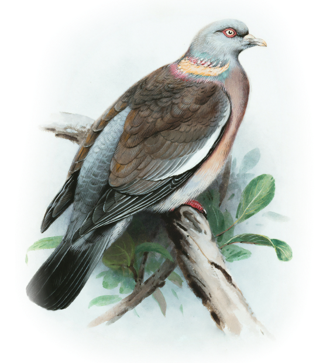

# 🖼️ Ink. House

Сайт-витрина магазина репродукций картин европейских художников.

🔗 **[Открыть сайт](https://muslimevloev.github.io/ink-house/)**

---

## О проекте

**Ink. House** — интернет-магазин репродукций живописи высокого качества. На сайте представлены работы французских, немецких и английских художников, выполненные на плотной бумаге или льняном холсте.

---

## Функциональность

- 🗂️ **Фильтрация по странам** — переключение между коллекциями Франции, Германии и Англии
- 🛒 **Каталог карточек** — карточки с изображением, автором, описанием и ценой
- 📱 **Адаптивный дизайн** — корректное отображение на мобильных, планшетах и десктопе
- 🍔 **Бургер-меню** — для мобильных устройств
- 🎨 **Промо-секция** — баннер с новой коллекцией
- 👥 **О нас** — блок с информацией о команде

---

## Стек технологий

| Технология | Описание |
|---|---|
| HTML5 | Разметка страницы |
| CSS3 | Стилизация, адаптивность (media queries) |
| JavaScript | Фильтрация карточек, бургер-меню |

---

## Структура проекта

```
ink-house/
├── index.html
├── css/
│   └── style.css
├── images/
│   ├── hero-bird.png
│   ├── card1_1.jpg
│   └── ...
├── icons/
│   ├── Logo.svg
│   └── ...
└── fonts/
    ├── Raleway-Light.ttf
    ├── Raleway-Medium.ttf
    └── Raleway-Bold.ttf
```

---

## Запуск локально

```bash
# Клонировать репозиторий
git clone https://github.com/muslimevloev/ink-house.git

# Открыть папку
cd ink-house
```

Затем открыть `index.html` через расширение **Live Server** в VS Code.

---

## Скриншот



---

## Автор

**Muslim Evloev** — [GitHub](https://github.com/muslimevloev)
